# webgl-mountain-examples

WebGL Mountain Example

## WebGL サンプル

### 黒部峡谷

### 御嶽山

### 箱根周辺

### 口永良部島

### 浅間山

### 桜島

[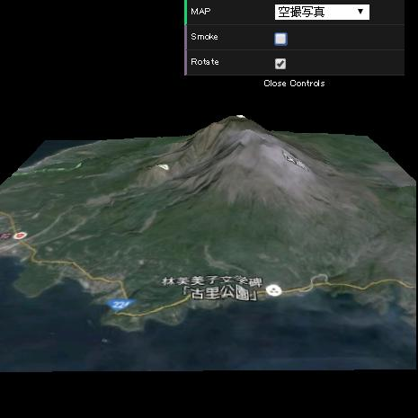](https://cx20.github.io/webgl-mountain-examples/jsdo.it/cx20/tDAV5/ "桜島の3Dデータを使ってみるテスト")

### 福島県と三県境周辺

[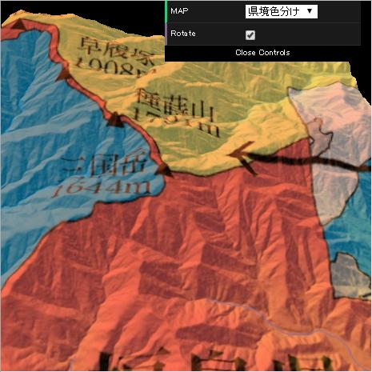](https://cx20.github.io/webgl-mountain-examples/jsdo.it/cx20/2oVv1/ "福島県と三県境周辺の3Dデータを使ってみるテスト")

### 阿蘇山

[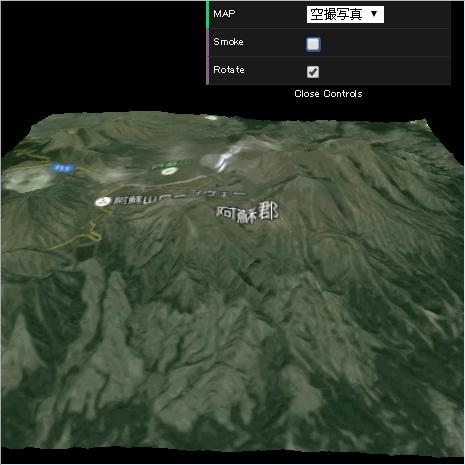](https://cx20.github.io/webgl-mountain-examples/jsdo.it/cx20/wtNjT/ "阿蘇山の3Dデータを使ってみるテスト")

### 草津の本白根山付近

[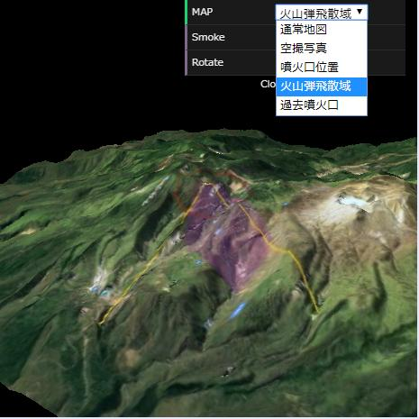](https://cx20.github.io/webgl-mountain-examples/jsdo.it/cx20/c48E/ "草津の本白根山付近の3Dデータを使ってみるテスト")

### 蔵王山付近

[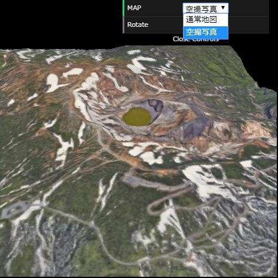](https://cx20.github.io/webgl-mountain-examples/jsdo.it/cx20/2rwl/ "蔵王山付近の3Dデータを使ってみるテスト")

### 新燃岳付近

[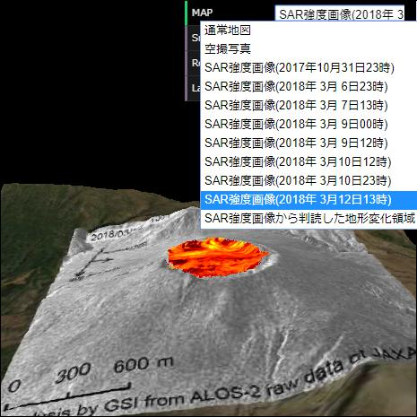](https://cx20.github.io/webgl-mountain-examples/jsdo.it/cx20/GhZA/ "新燃岳付近の3Dデータを使ってみるテスト")

### 霧島連山 硫黄山付近

[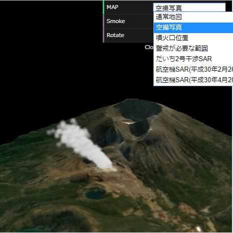](https://cx20.github.io/webgl-mountain-examples/jsdo.it/cx20/SLj8/ "霧島連山 硫黄山付近の3Dデータを使ってみるテスト")

<!--
### えびの高原から硫黄山方向

[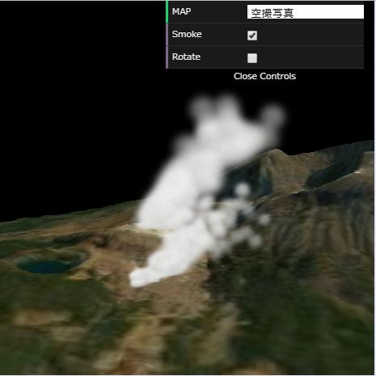](https://cx20.github.io/webgl-mountain-examples/jsdo.it/cx20/k7Nt/ "えびの高原から硫黄山方向の3Dデータを使ってみるテスト")
-->

### スーパーカミオカンデ付近

[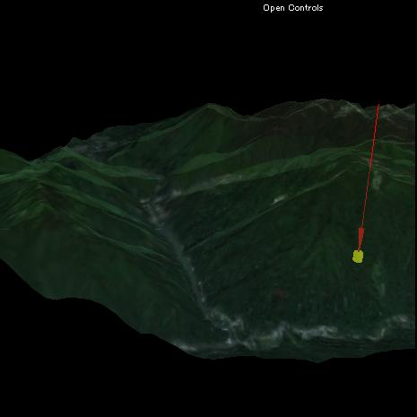](https://cx20.github.io/webgl-mountain-examples/jsdo.it/cx20/UDCT/ "スーパーカミオカンデ付近の3Dデータを使ってみるテスト")

### グランドキャニオン

[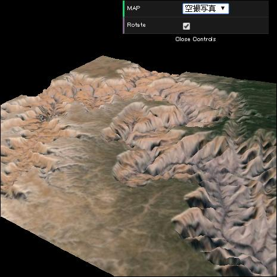](https://cx20.github.io/webgl-mountain-examples/jsdo.it/cx20/qzhR/ "グランドキャニオンの3Dデータを使ってみるテスト")

### シャクルトンクレーター

[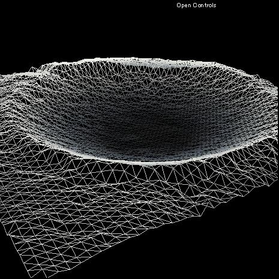](https://cx20.github.io/webgl-mountain-examples/jsdo.it/cx20/u4aV/ "Three.js で月のクレーターを表示させてみるテスト")
